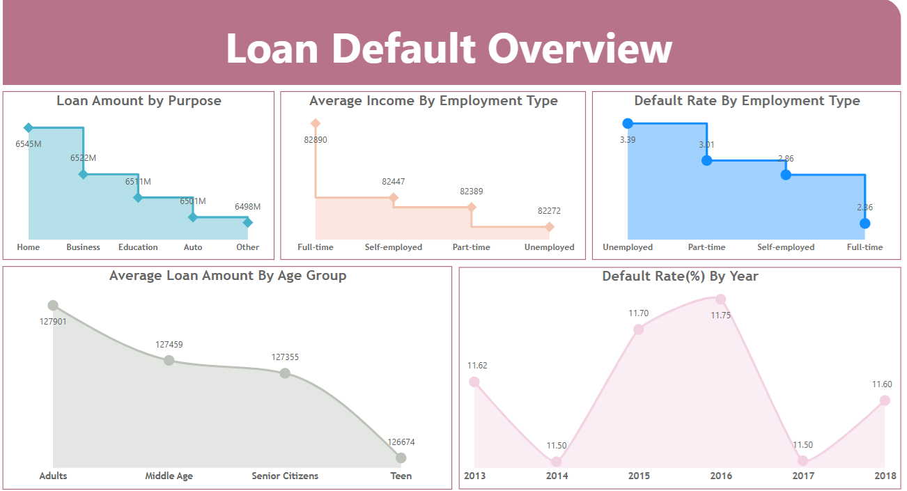
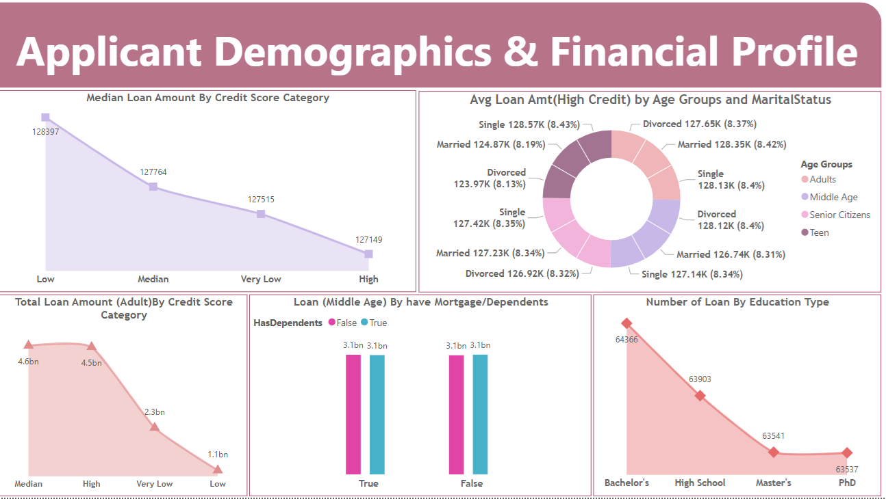

## Table of Contents
- [Objective](#objective)
- [Data Preparation](#data-preparation)
- [Custom Columns Created](#custom-columns-created)
- [DAX Measures for Key Business Metrics](#dax-measures-for-key-business-metrics)
- [Visualization](#visualization)
- [Key Insights](#key-insights)
- [Report Publishing](#report-publishing)
- [Conclusion](#conclusion)
## Loan Default Analysis
**Tools used :** Power BI Desktop, SQL Server Management Studio
**Data Source :** Dataflow
**Domain :** Banking
## Objective
To build an interactive Power BI report using a Loan Default Dataset, aimed at identifying key factors that influence loan repayment. The goal is to help bank    officials make informed decisions by highlighting patterns in borrowing profiles and past defaults, ultimately reducing future loan risks.
## Data Preparation
- Connected Power BI to an SQL Server source via Dataflow and imported data into Power BI Desktop.
- Cleaned and transformed data using Power Query Editor
  - Adjusted data types
  - Renamed columns for clarity
  - Performed column profiling for data quality
## Custom Columns Created
- Age Grouped: Categorized borrowers into age-based segments to support analysis of loan patterns across different life stages.
- Credit Score Bins: Grouped borrowers by credit score to highlight differences in risk and repayment patterns.
- Income Brackets: Grouped borrowers by income levels to analyze loan trends.
## DAX measures for key business metrics
- Average Income by Employment Type: Calculates average income by employment type using `CALCULATE` and `ALLEXCEPT` to maintain group context    while removing other filters.
```dax
Avg Income By Emp type = 
CALCULATE(AVERAGE('Loan Dataset'[Income]),
ALLEXCEPT('Loan Dataset','Loan Dataset'[EmploymentType]))
```
- Default Rate by Employment Type: Calculates the default rate by employment type using `DIVIDE` and `CALCULATE` to apply row filters and        handle division safely.
```dax
Default Rate = 
DIVIDE(
    CALCULATE(COUNTROWS('LoanData'), 'LoanData'[LoanStatus] = "Default"),
    CALCULATE(COUNTROWS('LoanData')),
    0
)
``` 
- Avg Loan Amt (High Credit): Calculates the average loan amount for entries where the credit score is categorized as "High".
```
Avg Loan Amt(High Credit) = 
AVERAGEX(FILTER('Loan Dataset','Loan Dataset'[Credit Score Bins] = "High"),'Loan Dataset'[LoanAmount])
```
- Median Loan Amount by Credit Score Category using MEDIAN.
## Implemented time intelligence
- YOY (Year-over-Year) percentage change in defaulted loans by comparing the current year's count of defaults to the previous year's, using CALCULATE, FILTER, and   DIVIDE to handle row context, date logic, and avoid divide-by-zero errors.
```YOY Default Loan Change By Year = 
DIVIDE(
    CALCULATE(COUNTROWS(FILTER('Loan Dataset','Loan Dataset'[Default]=True())),'Loan Dataset'[Year] = YEAR(MAX('Loan Dataset'[Loan_Date]))) - 
    CALCULATE(COUNTROWS(FILTER('Loan Dataset','Loan Dataset'[Default]=True())),'Loan Dataset'[Year] = YEAR(MAX('Loan Dataset'[Loan_Date]))-1),
    CALCULATE(COUNTROWS(FILTER('Loan Dataset','Loan Dataset'[Default]=True())),'Loan Dataset'[Year] = YEAR(MAX('Loan Dataset'[Loan_Date))-1),0) * 100
```
- YTD (Year-to-Date) loan amount is calculated using CALCULATE and DATESYTD to sum loans from the beginning of the year up to the current date, while ALLEXCEPT keeps the grouping by Credit Score Bins and Marital Status.
```YTD Loan Amount By Credit Score Bins & Marital Status = 
CALCULATE(SUM('Loan Dataset'[LoanAmount]),DATESYTD('Loan Dataset'[Loan_Date].[Date]),ALLEXCEPT('Loan Dataset','Loan Dataset'[Credit Score Bins],'Loan Dataset'[MaritalStatus]))
```
## Visualization

### Page 1: Loan Default Overview

 

- Donut Chart: Visualizes the average loan amount for high credit score customers segmented by marital Status and age group.
- Line Chart: Displays year-over-year changes in loan default rates.
   
- Ribbon Chart: The ribbon chart visualizes the YTD loan amount across credit score bins, segmented by marital status, showing value distribution and rank           changes. YTD is dynamically calculated based on the latest year in the dataset.
  
- Used a Decomposition Tree to analyze Loan Amount by Income Bracket and Employment Type, enabling interactive drilldowns and insights.

  
## Key Insights
- Unemployment drives the highest default rate (3.39%), making employment status a key risk indicator.
  - Helps refine approval criteria based on job stability.
- Default rates remained consistent between 11.5%–11.75% from 2013 to 2018, indicating long-term risk stability.
  - Useful for forecasting and long-term risk planning.
- Loan amounts are evenly distributed across purposes and age groups, with an average of approximately $127K.
  - Suggests consistent lending behavior across demographics. 
- High credit score borrowers, especially married ones, receive the largest median loans and show better repayment, confirming credit scoring’s role in risk         segmentation.
  - Supports credit-based loan prioritization. 
  
## Report Publishing
- Performed data validation to ensure accuracy and consistency of key metrics and calculated measures.
- Enabled scheduled refresh for the Dataflow, configured incremental refresh, and published the report to Power BI Service with report-level scheduled updates.

## Conclusion

