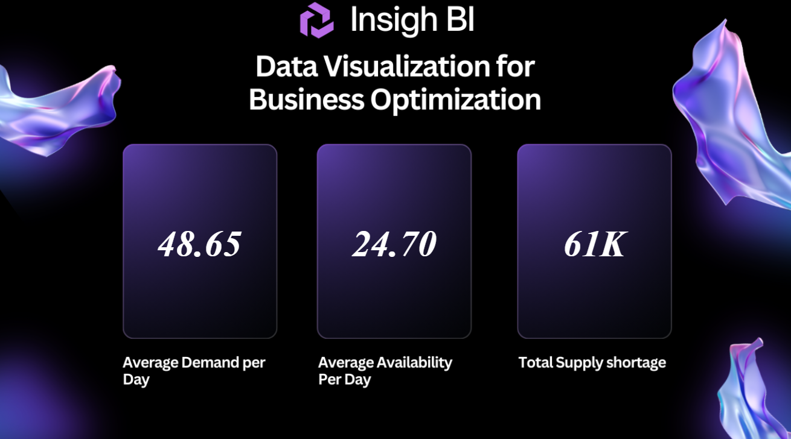
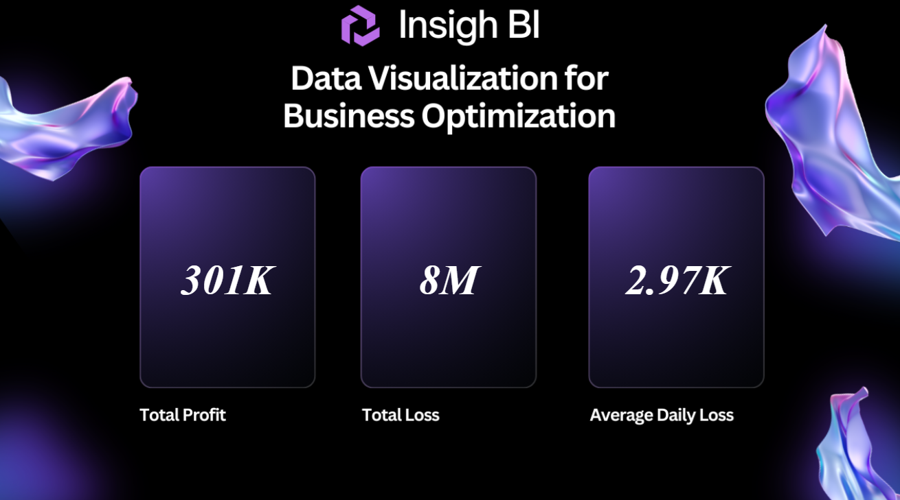

## Table of Contents
- [Objective](#objective)
- [Data Preparation](#data-preparation)
- [Custom Columns Created](#custom-columns-created)
- [DAX Measures for Key Business Metrics](#dax-measures-for-key-business-metrics)
- [Visualization](#visualization)
- [Key Insights](#key-insights)
- [Report Publishing](#report-publishing)
- [Conclusion](#conclusion)
- [What I Learned](#what-i-learned)
## Inventory Management Dashboard
Designed a Power BI dashboard to analyze supply-demand trends in a retail inventory dataset. Integrated SQL Server and MySQL for data management, created DAX-based KPIs, and published a production-ready report.

**Tools used:**
---

| Tool         | Purpose                         |
|--------------|---------------------------------|
| Power BI     | Dashboard creation              |
| SQL Server   | Data joins, cleaning, KPIs      |
| MySQL        | Production environment & testing|
| DAX          | Measures & KPI logic            |
| Power Query  | Data transformation & migration |

---
 
**Data Source:** Raw data in CSV format, imported into SQL Server (test) and MySQL (production) for dashboard development in Power BI.
- Test Data
  - `Test Environment Inventory Dataset.csv`: ...Contains sample inventory records for development and test purposes, including daily              product demand and availability.
- Production Data  
  - `Prod Env Inventory Dataset.csv`: ...Complete inventory records from the production environment for final analysis.
- Reference Data 
  - `Products.csv`: ...Contains products details like Product ID, Name, and Unit Price used to link product details and calculate KPIs. 

**Domain :** Retail

## Objective
Developed an inventory dashboard in Power BI to simulate a real-world enterprise reporting system with a focus on clean, validated reporting workflow.
-  Designing and validating the solution in a test environment
-  Creating insightful KPIs and DAX measures for supply-demand monitoring
-  Transitioning the dashboard to a production environment
-  Switching the data source from SQL Server to MySQL

# Data Preparation

## Test Environment
- Imported raw CSV files into the SQL Server test environment to simulate a real-world data source.
- Joined the Products and Test Inventory tables using a LEFT JOIN to merge product details with inventory records.
- Imported the merged dataset into Power BI Desktop.
- Handled NULL values and ensured clean entries in fields like Order Date, Product ID, Demand, and Availability.
- Updated data types (e.g., Order Date to Date), renamed tables, and applied consistent background themes.

## Production Environment
- Imported production inventory data into SQL Server.
- Cleaned the dataset by correcting two extra product IDs (21 and 22) to 7 and 11 respectively using SQL UPDATE queries.
- Reapplied the same LEFT JOIN logic with the Products table.
- Transitioned the Power BI report from test to production by updating Data Source Settings and validated the results.

## Notes
- The production environment setup was later replicated in MySQL by rewriting SQL logic and updating Power BI           connections via the      Advanced Editor.

## Custom Columns Created

- Loss/Profit: Created a Loss/Profit column by subtracting demand from availability, multiplied the result by unit price to calculate total      value impact, and derived average daily loss for better inventory and performance analysis.

## DAX measures for key business metrics

- Avg Demand Per Day: Calculates the average quantity demanded per day across the dataset to understand daily consumption patterns.

```Dax
Avg Demand Per Day = DIVIDE([Total Demand],[Total Number of Days])
```
- Avg Availability  Per Day: Computes the average available stock per day to monitor supply levels and warehouse readiness.

```Dax
Avg Availability Per Day = DIVIDE([Total Availability],[Total Number of Days])
```
- Total Supply Shortage: Measures the cumulative difference where demand exceeded availability, highlighting unmet demand.

```Dax
Total Supply Shortage = [Total Demand] - [Total Availability]
```
- Total Profit: Calculates total value generated where availability met or exceeded demand, multiplied by unit price.

```Dax
Total Profit = 
SUMX(
    FILTER(
        'Availability/Demand Dataset',
        'Availability/Demand Dataset'[Loss/Profit] > 0
    ),
    'Availability/Demand Dataset'[Loss/Profit] * 'Availability/Demand Dataset'[unit_price]
)
```
- Total Loss: Sums up the lost opportunity value where availability fell short of demand, indicating stockout impact.

```Dax
Total Loss = 
SUMX(
    FILTER(
        'Availability/Demand Dataset',
        'Availability/Demand Dataset'[Loss/Profit] < 0
    ),
    'Availability/Demand Dataset'[Loss/Profit] * 'Availability/Demand Dataset'[unit_price]
) * -1
```
- Average Loss Per Day: Determines the average loss per day due to supply shortages, helping evaluate recurring inefficiencies.

```Dax
Avg Loss Per Day = DIVIDE('Measures 1'[Total Loss],'Measures 1'[Total Number of Days])
```  

## Visualization

- Built a Power BI dashboard to present demand, availability, and inventory-related metrics across two report pages.
- Used Card visuals (3 per report page) for clear, focused presentation.
- Organized visuals across two report pages:
  - **Page 1**: Demand-Supply Overview – KPI cards for Average Daily Demand, Availability, and Supply Shortage.



  - **Page 2**: Financial Impact – KPI cards for Total Profit, Total Loss, and Average Daily Loss.



- Used filters for Product ID and Order Date to enable data slicing and focused analysis.
 
## Key Insights

**91% of Orders Faced Shortages in Production**
- 91% of production orders had stock shortages, totaling 63,925 units — highlighting the need for better inventory forecasting.

**Estimated 12–15% Revenue Loss Due to Stockouts**
- Despite $6.93M in revenue, missed demand led to an estimated 12–15% revenue loss, indicating growth potential through improved stock availability.

**Average Shortfall of 59 Units per Order = ~24% Unfulfilled Demand**
- Average supply shortfall per order was ~24%, reflecting gaps in demand forecasting and warehouse replenishment. 
  
## Report Publishing

- Published the Power BI report to Power BI Service using test and production data sources with validated visuals and KPIs.

## Conclusion

This project provided hands-on experience in building an end-to-end inventory dashboard using Power BI. It enhanced my skills in data cleaning, SQL-based data integration, DAX, and publishing reports — simulating a real-world reporting workflow and delivering key business insights.

## What I learned
- Applied SQL, DAX, and Power Query to build a fully functional Power BI dashboard.
- Handled test and production data environments with source switching and validation.
- Designed custom KPIs for tracking inventory gaps, profit, and loss.
- Developed analytical thinking by identifying supply-demand gaps and uncovering key business insights from data.

Thanks for checking out this project!

