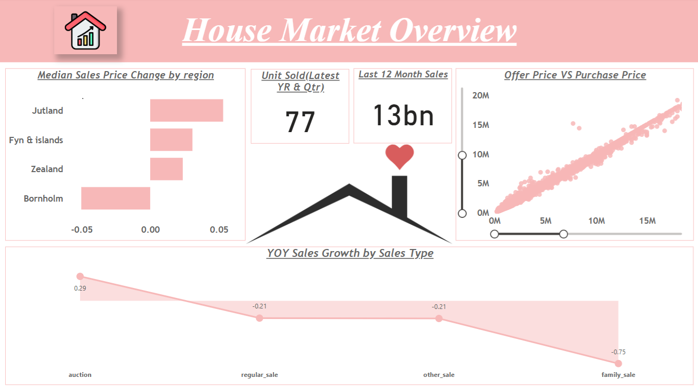
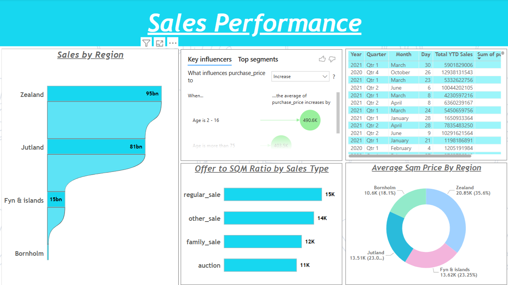
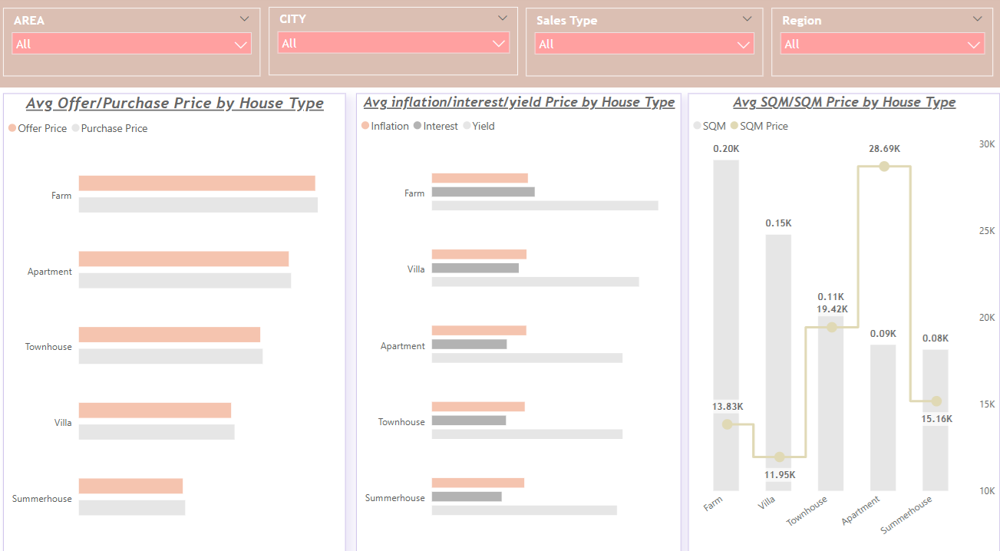

## Table of Contents
- [Objective](#objective)
- [Data Preparation](#data-preparation)
- [Custom Columns Created](#custom-columns-created)
- [DAX Measures for Key Business Metrics](#dax-measures-for-key-business-metrics)
- [Visualization](#visualization)
- [Key Insights](#key-insights)
- [Report Publishing](#report-publishing)
- [Conclusion](#conclusion)
- [What I Learned](#what-i-learned)

## Housing Data Analysis 
This is an end-to-end business intelligence project built using Power BI, showcasing expertise in data cleaning, DAX calculations, and interactive visualizations. It features cloud integration with Google BigQuery, SQL-based transformations, and deployment to the Power BI Service.

**Tools used :**
---

| Tool         | Purpose                         |
|--------------|---------------------------------|
| Power BI     | Dashboard creation              |
| SQL Server   | Data joins, cleaning, KPIs      |
| DAX          | Measures & KPI logic            |
| Power Query  | Data transformation & migration |
| Google Big Query  | Cloud-based data storage & SQL operations |

---

**Data Source :** 
- **Google BigQuery** (connected to Power BI)
- Original CSV file: `Housing Data.csv`

**Domain :** Real Estate Analytics

## Objective
To analyze housing market data and generate actionable insights on sales trends, pricing patterns, regional performance, and property features using Power BI for effective decision-making.

## Data Preparation
- Loaded raw CSV data into **Google BigQuery** and connected it to **Power BI**.
- Used **SQL in BigQuery** for data exploration and transformation:
  - Applied aggregations and conditional logic.
  - Calculated average purchase price by sales type.
  - Normalized area data by setting `SQM = 100` where `no_rooms = 3`.
- Used **Power Query Editor** for further data cleaning:
  - Removed duplicates and renamed columns for clarity.
  - Replaced null values:
    - `Inflation Rate` → 1.85  
    - `Yield on Mortgage Credit Bonds` → 1.47
  - Performed column profiling and data quality checks.
- Final dataset was cleaned, structured, and ready for reporting and DAX modeling in Power BI.

## Custom Columns Created
- **Age of Property** 
  Calculates how old the property is at the time of sale.  
  *Used to analyze the relationship between property age and purchase price in visualizations.* 
```Dax
Age = ABS(YEAR('Housing Data'[date]) - 'Housing Data'[year_build])
```
- **Estimated Offer Price**
  Calculates the initial offer price based on the final purchase price and the percentage change between them.
  *Helps visualize negotiation patterns and understand pricing strategy differences.*
```Dax
Offer Price = (100*'Housing Data'[purchase_price])/(100-'Housing Data'[%_change_between_offer_and_purchase])
```

## DAX measures for key business metrics
- Avg Sqm Price: Calculates the average cost per square meter.  
  *Used to compare property value across regions and property types.* 
```dax
  Avg Sqm Price = AVERAGE('Housing Data'[sqm_price])
```
- Last 12-Month Sales: Calculates the total purchase price for the last 12 months based on the selected date context.  
  *Used to track recent annual sales performance and monitor market momentum.* 
```dax
  Last 12 Month Sales = 
  CALCULATE(
    SUM('Housing Data'[purchase_price]),
    DATESINPERIOD('Housing Data'[date], MAX('Housing Data'[date]), -12, MONTH)
)
``` 
- Offer to SQM Ratio: Calculates the average offer price per square meter.
  *Used to compare buyer willingness to pay relative to property size.*  
```Dax
  Offer to SQM Ratio = 
  DIVIDE(
    SUM('Housing Data'[Offer Price]),
    SUM('Housing Data'[sqm])
```
- Sales by Region: Calculates total sales while preserving filter context only for the region.
  *Used to analyze regional sales performance without being affected by other filters.*
```Dax
  Sales by Region = 
  CALCULATE(
    SUM('Housing Data'[purchase_price]),
    ALLEXCEPT('Housing Data', 'Housing Data'[region])
  )
```
- Units Sold in Latest Year & Quarter: Counts unique houses sold in the most recent year and quarter based on the selected date context.
  *Used to monitor recent market activity at a granular time level.* 
```Dax
 Unit Sold in latest Year & Quarters = 
  CALCULATE(
    DISTINCTCOUNT('Housing Data'[house_id]),
    YEAR('Housing Data'[date]) = YEAR(MAX('Housing Data'[date])) &&
    QUARTER('Housing Data'[date]) = QUARTER(MAX('Housing Data'[date]))
  )
```
## implemented Time Inteligence

- Total YTD (Year-to-Date) Sales: Calculates cumulative purchase price from the start of the year up to the current date.
  *Used to track yearly sales performance as it progresses.*
```Dax
  Total YTD Sales = 
  TOTALYTD(
    SUM('Housing Data'[purchase_price]),
    'Housing Data'[date].[Date]
  )
```
- YOY Sales Grow: Calculates the percentage change in total purchase price between the current and previous year.
  *Used to assess annual growth trends and market momentum.*
```Dax
  YOY_Sales_Growth = 
  VAR CurrYearSales = 
      CALCULATE(
          SUM('Housing Data'[purchase_price]),
          YEAR('Housing Data'[date]) = YEAR(MAX('Housing Data'[date]))
      )
  VAR PrevYearSales = 
      CALCULATE(
          SUM('Housing Data'[purchase_price]),
          YEAR('Housing Data'[date]) = YEAR(MAX('Housing Data'[date])) - 1
      )
  RETURN
      IF(PrevYearSales <> 0, (CurrYearSales - PrevYearSales) / PrevYearSales, BLANK())
```
## Visualization

### Page 1: House Market Overview
A high-level dashboard showcasing key housing market insights.



**Visuals:**
- **Scatter Plot - Offer Price vs Purchase Price** Visualizes how closely actual purchase prices align with listed offer prices.
- **Stacked Bar Chart - Median Sales Price Change by Region** Compares year-over-year price changes across different regions.
- **Line Chart – YoY Sales Growth by Sales Type**: Shows annual sales growth trends segmented by sale types (e.g., auction, family, regular).
- **KPI Cards – Units Sold & Last 12-Month Sales**: Highlights total units sold and cumulative sales value over the past year.
### Page 2: Sales Performance
Analyzes sales volume, pricing drivers, and regional efficiency metrics.



**Visuals:**
- **Stacked Bar Chart – Sales by Region**: Compares total sales volume across regions.
- **Key Influencer – Purchase Price by Age**: Identifies how property age affects purchase price.
- **Pie Chart – Avg. SQM Price by Region**: Shows average price per square meter by region.
### Page 3: House Type Analysis
Compares pricing and financial metrics across different property types.



**Visuals:**
- **Clustered Bar Chart – Avg. Offer vs Purchase Price by House Type**: Highlights pricing differences by house type.
  **Avg. Inflation, Interest, Yield by House Type**: Shows financial factor impact per house type.
- **Line & Clustered Column Chart – Avg. SQM & SQM Price by House Type**: Visualizes size and per sqm price distribution.
- **Slicers – Region, Area, City, Sales Type**: Enables multi-level filtering across all visuals.

## Key Insights

**88% of Properties Sold Close to Asking Price**
- The scatter plot shows a strong correlation between offer and purchase prices, indicating minimal negotiation and a transparent, price-efficient housing market.
**Zealand Shows 12.5% YoY Median Price Increase**
- Regional analysis highlights these as high-growth areas, signaling demand concentration and investment hotspots.
**Row Houses Have 22% Higher Avg. SQM Price Than Villas**
- House type analysis reveals strong market preference or scarcity driving higher per-square-meter pricing for row houses.
**Mid-Aged Properties (10–20 Years) Sell at an 18% Premium**
- Buyers are willing to pay more for moderately aged homes, reflecting a balance between modern features and structural stability.

## Report Publishing
- Report published on **Power BI Service** for interactive access.
- Supports **filters, drill-throughs, and cross-highlight** interactions.

## Conclusion
This project helped uncover how pricing, location, and property type influence housing market trends. The report makes it easy to compare regions, spot high-value property types, and understand buyer behavior. It’s a simple, clear way to turn raw data into insights that matter.

## What I Learned
- How to design and structure a complete Power BI report for real-world analysis.
- Gained hands-on experience with DAX, data modeling, and interactive visualizations.
- Applied page-level filters to enhance user-driven insights (e.g., house type analysis by region, city, and sales type).
- Learned how to connect and transform housing data into a meaningful story using Power BI.

Thanks for checking out this project!
