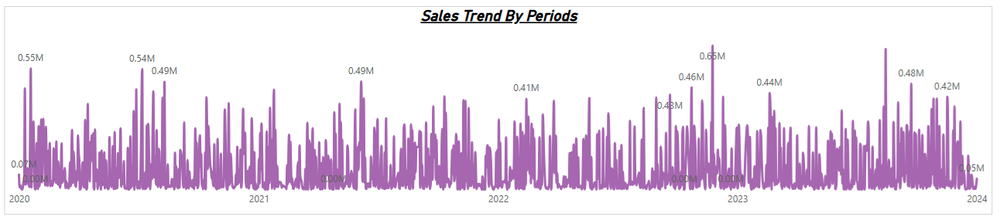
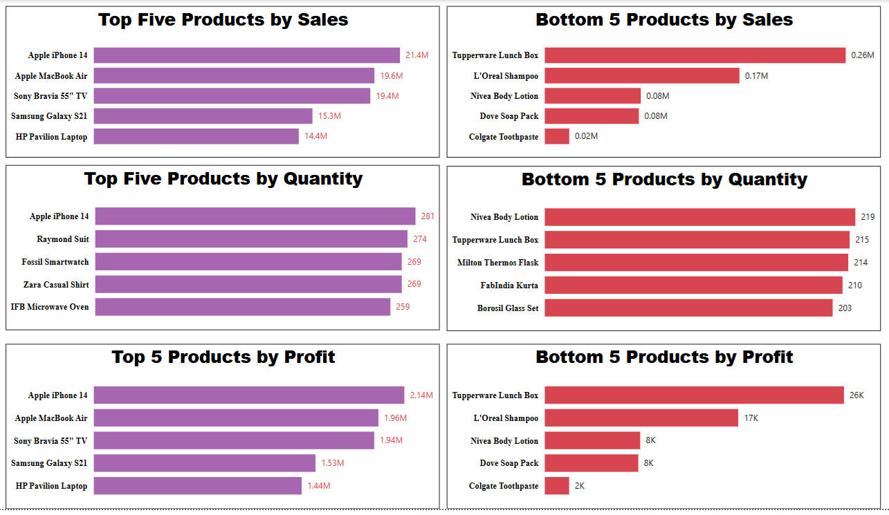
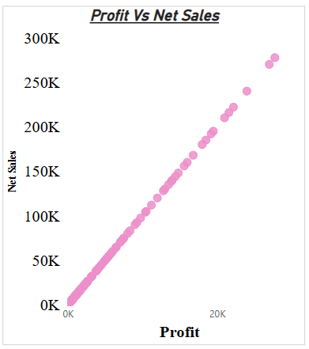

## Sales Data Analysis
**Tools used :** Power BI Desktop, Excel

**Domain :** Sales

## Objective
Analyzing sales data to identify top/bottom products, analyze trends, compare performance, and calculate various metrics. 

## Data Preparation
Imported data from Excel containing customer orders, product details, and promotions. Cleaned and transformed the data using Power Query Editor.

## Custom Column Created
- Calculated Net Sales, Profit, and Discount Percentage columns using simple formulas during data transformation.
- Added a Year column from the date for trend analysis.

## DAX Measures for Key Business Metrics
- **Sum of Net Sales:** Calculates total Net Sales using an alternate date filter.
Used to compare sales across custom time periods by activating an inactive date relationship.
```Dax
Sum of Net Sales = 
CALCULATE(
    SUM('Fact Table'[Net Sales]),
    ALL('Date Table 1'), // Removes filter from Date Table 1 for comparison
    USERELATIONSHIP('Date Table 2'[Date], 'Fact Table'[Date (dd/mm/yyyy)]) // Activates inactive relationship for custom date comparison
)
```
- **Total Profit:** Calculates total profit using an alternate date context.
Used to analyze profit across user-selected periods by activating a secondary date relationship.
```Dax
Total Profit = 
CALCULATE(
    SUM('Fact Table'[Profit]),
    ALL('Date Table 1'),
    USERELATIONSHIP('Date Table 2'[Date], 'Fact Table'[Date (dd/mm/yyyy)])
)
```
- **Total Quantity:** Calculates total units sold using an alternate date filter.
Used to compare quantities sold between two user-defined time periods using inactive relationship logic.
```Dax
Total Quantity = 
CALCULATE(
    SUM('Fact Table'[Units Sold]),
    ALL('Date Table 1'),
    USERELATIONSHIP('Date Table 2'[Date], 'Fact Table'[Date (dd/mm/yyyy)])
)
```

## Visualization
- **Line Chart – Sales Trend Over Years**: Displays annual sales and profit progression from 2020 to 2024 to highlight peak and low-performing years.

- **Bar Charts – Top/Bottom 5 Products**: Visualizes best and worst performers by Sales, Profit, and Quantity to aid inventory and pricing decisions.

- **Scatter Chart – Profit vs Net Sales**: Shows the relationship between net sales and profit to analyze product-level profitability.

- **Slicers – Product, Date, Promotion, Customer**: Enables interactive filtering for detailed exploration of metrics.  

## Key Insights
- Apple iPhone 14 and MacBook Air were top performers in both sales and profit.
- Analyzed time-based sales trend showing 400% growth from 2020 to 2022.
- Revealed 80% of discounts came from Clearance & Weekend Flash Sale.
## Report Publishing
Prepared and presented the dashboard in Power BI Desktop for internal analysis use. 
## Conclusion
This project helped explore and communicate business trends effectively through visual analytics, focusing on product and promotion performance.
