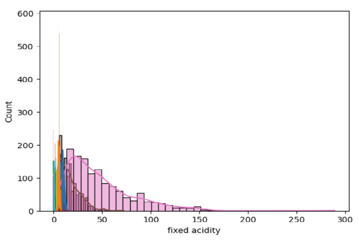
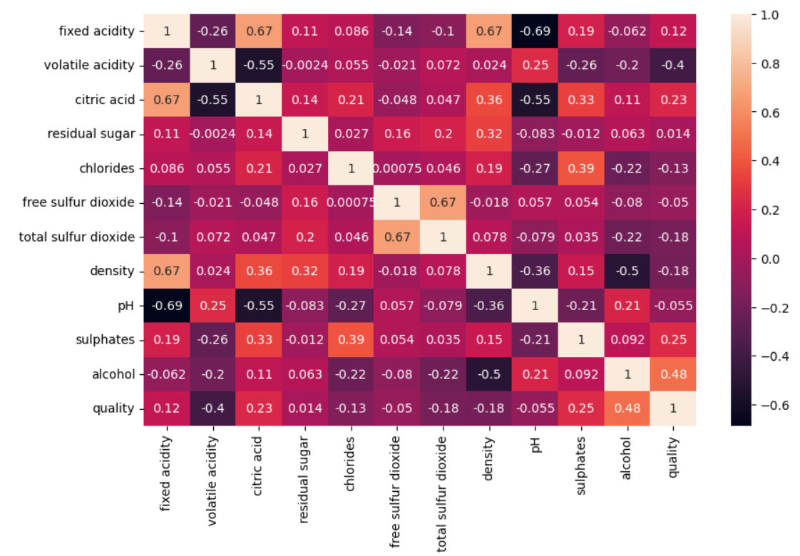
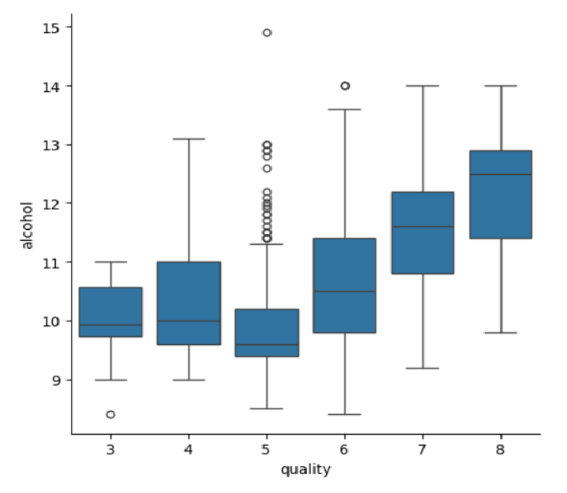

## Wine Quality Exploratory Data Analysis (EDA)
This project presents a detailed **Exploratory Data Analysis (EDA)** of the Wine Quality dataset using Python. It aims to uncover insights into the chemical properties of wine and their impact on quality ratings, using statistical methods and rich visualizations. The project was developed using **Jupyter Notebook** within **Visual Studio Code (VS Code)**.

## Dataset
- **Source**: [UCI Machine Learning Repository](https://archive.ics.uci.edu/ml/datasets/Wine+Quality)
- **Type**: Multivariate  
- **Samples**: 1,599 red wine observations  
- **Features**: 11 physicochemical inputs + 1 quality score (0–10)  
- **Task**: Regression or ordinal classification

## Tools & Technologies
- **Python**
- **Jupyter Notebook**
- **Visual Studio Code (VS Code)**
- **Pandas** – data manipulation
- **NumPy** – numerical operations
- **Matplotlib** & **Seaborn** – visualizations
- **Plotly** – interactive visualizations
- **SciPy** – statistical analysis

## Objective
- Perform structured EDA to uncover patterns and correlations
- Identify key variables that influence wine quality
- Visualize data distributions and relationships
- Address data quality issues such as duplicates and imbalance

## Exploratory Data Analysis

### Data Preprocessing
- Inspected data structure using `.info()` and `.describe()`
- Checked for missing values – **None found**
- Identified and removed **240 duplicate rows**
- Reviewed value distribution for the `quality` variable

### Univariate Analysis
- Plotted **histograms** with KDE to understand feature distributions

- Detected **skewness** in features like `residual sugar` and `sulphates`

### Correlation Analysis
- Created a **correlation matrix heatmap**

- Found strong positive correlation between `alcohol` and `quality`
- Observed negative correlation between `volatile acidity` and `quality`

### Bivariate & Multivariate Analysis
- Used **pairplots** to explore feature interactions
- **Boxplots** and **scatter plots** for quality vs. key features

- Visualized class imbalance using bar plots

## Key Insights

- **Alcohol** is the most positively correlated factor with wine quality  
- Wines with **lower volatile acidity** tend to receive higher ratings  
- The dataset is **imbalanced**, with most wines rated 5 or 6  
- Some features may benefit from scaling or transformation in modeling

## How to Run

1. Clone the repository:
   ```bash
   git clone https://github.com/Mukul703/wine-quality-eda.git
   cd wine-quality-eda

2. Open the notebook:
- Use Jupyter Notebook
  ```bash
  jupyter notebook
Then open 1.0-WinequalityEDA.ipynb in your browser.
- Or open the notebook in Visual Studio Code with the Jupyter extension.

3. Run all cells sequentially to reproduce the analysis.

